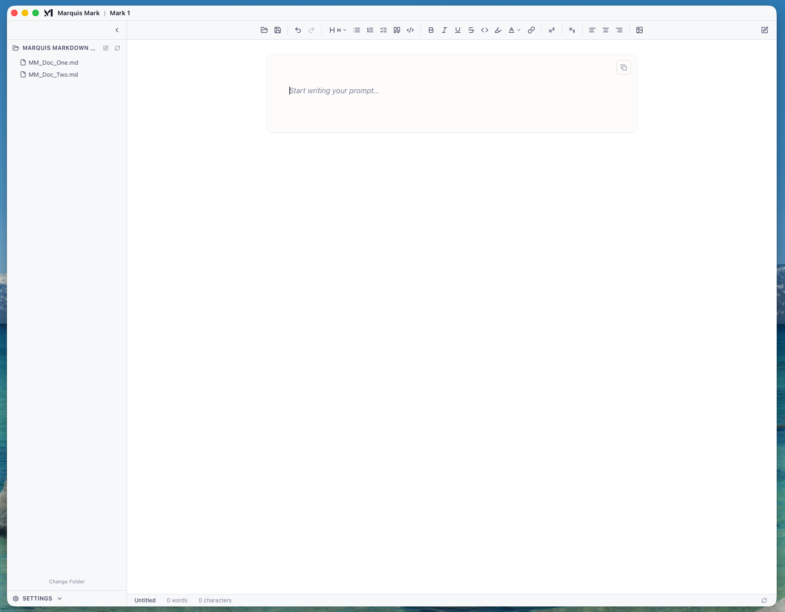

<div align="center">

# Marquis Markdown Mark 1


</div>

A local desktop markdown editor built for authoring prompts for Claude and GPT models. Think Typora, but purpose-built for prompt engineering.

<div align="center">
    
</div>
https://github.com/user-attachments/assets/60b887e3-2d94-476c-80cb-e1e5e488ab2f

 <video src="./screen_record.mp4" controls width="700"></video>


## Features

- **WYSIWYG Markdown** — Formatting renders inline as you type (headings, bold, lists, code blocks, etc.)
- **XML Tag Auto-close & Auto-indent** — Tags are automatically closed and content is indented
- **AI Writing Assistant** — Select text and invoke Claude (via Bedrock) to rewrite, summarize, or transform it inline
- **Spellcheck** — Built-in spellcheck with suggestions and an ignore list

## Tech Stack

|   Layer    | Technology                                                        |
|:----------:|:------------------------------------------------------------------|
|  Desktop   | [Tauri v2](https://v2.tauri.app/) (Rust backend, system webview)  |
|  Frontend  | React 19 + TypeScript + Vite                                      |
|   Editor   | [TipTap v2](https://tiptap.dev/) (ProseMirror-based WYSIWYG)      |

## Prerequisites

- [Rust](https://rustup.rs/) (1.77+)
- [Node.js](https://nodejs.org/) (20+)
- npm

## Getting Started

```bash
# Install dependencies
npm install

# Run in development mode (hot-reloading frontend + Rust backend)
npm run tauri dev

# Build for production
npm run tauri build
```

## Project Structure

```
marquisMark/
├── src/                    # React frontend
│   ├── components/
│   │   └── editor/         # TipTap editor, toolbar, AI menu, spellcheck
│   ├── extensions/         # Custom TipTap extensions (XML blocks, spellcheck)
│   ├── services/           # Markdown parsing/serialization, spellcheck
│   └── lib/                # HTML tag definitions, constants
│
└── src-tauri/              # Rust backend
    └── src/
        └── commands/       # Tauri commands (file I/O, AI, tokens)
```
